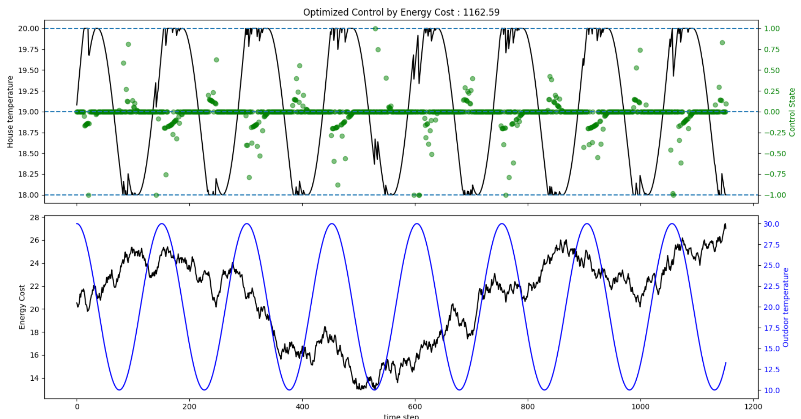

## Optimal HVAC Control for Buildings

This model finds the optimal control routine for heating and cooling a building based on the variable energy cost from
the grid. 

The cost of energy can be monetary, or a quantified carbon impact as demonstrated in
[this paper](https://www.watttime.org/app/uploads/2019/03/Optimal-Refrigeration-Control-For-Soda-Vending-Machines_May_2015.pdf)
by Zoltan DeWitt and Matthew Roeschke. Data on your grid's marginal emmissions rate can be found using the
[WattTime API.](https://www.watttime.org/api-documentation/#introduction)

The building temperature update model is based on [this open source simple energy model](https://github.com/timtroendle/simple-simple)
by Tim Tröndle, using the paywalled ISO 13790 standards.

The optimal control schedule is found using the python PuLP module. Control is continuous by default, with max wattage
towards heating = 1.0, and -1.0 = max cooling. Control your system's max wattage with the `HVAC.maximum_power`
parameter.

To optimize integer or binary control (only on or off), set `RunSim` class `int_opt_only` parameter to True, and
adjust `window_size` as necessary to account for the slowdown added by integer constraints.

To add new temperature and energy cost forecasts, add CSV to `data/` folder.

To run simulation with test data and output plots, run `python simulation.py`

Run tests with `pytest`

